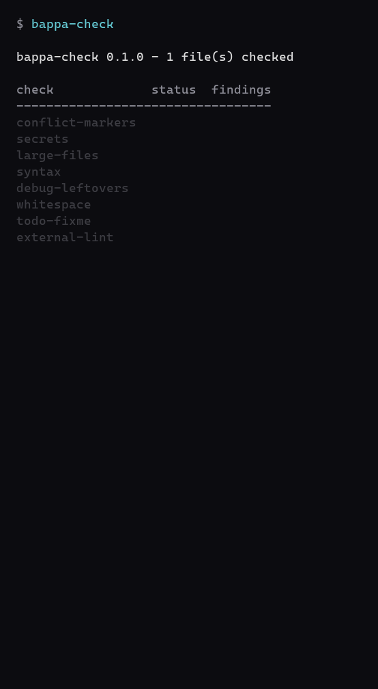

# bappa-check

[](https://github.com/ASHinarretable/bappa-check/actions/workflows/ci.yml)
[](https://pypi.org/project/bappa-check/)
[](LICENSE)

A fast, zero-config sanity check for your staged files — merge-conflict
markers, hardcoded secrets, oversized files, syntax errors, debug leftovers,
and more. Pass, and you get blessed by an animated ASCII Ganesha with a green
**BAPPA APPROVED** badge. Fail, and the commit is blocked until you fix it.



## Install

```bash
pip install bappa-check
```

(Also on [PyPI](https://pypi.org/project/bappa-check/). To install straight from source instead: `pip install git+https://github.com/ASHinarretable/bappa-check.git`.)

## Usage

Run it anytime — by default it checks whatever you've `git add`ed:

```bash
bappa-check
```

```
bappa-check                 # check staged files (default)
bappa-check --all           # check every tracked file in the repo
bappa-check path/ file.py   # check specific files/directories
bappa-check --strict        # treat warnings as failures too
bappa-check --no-anim       # skip the animation, print static art only
bappa-check --install-hook  # wire it up as this repo's git pre-commit hook
bappa-check --uninstall-hook
bappa-check --version
```

Exit code is `0` on success, `1` on failure — so it plugs straight into `git commit` as a gate. Set `BAPPA_NO_ANIM=1` to always skip the animation (handy in CI or over a slow SSH session); it also auto-skips whenever output isn't a real terminal.

## What it checks

Every check runs against your staged files (or whatever paths you pass) with **zero configuration** — no matter what language your repo is in.

| Check | Severity | What it catches |
|---|---|---|
| `conflict-markers` | fail | Unresolved `<<<<<<<` / `=======` / `>>>>>>>` from a bad merge |
| `secrets` | fail | AWS keys, private key blocks, GitHub/Slack tokens, hardcoded `password =` / `api_key =` assignments |
| `large-files` | fail | Any staged file over 5 MB |
| `syntax` | fail | Broken `.py` / `.json` / `.toml` / `.yaml` |
| `debug-leftovers` | warn | Stray `breakpoint()`, `pdb.set_trace()`, `console.log(`, `debugger;` |
| `whitespace` | warn | Trailing whitespace, missing newline at end of file |
| `todo-fixme` | info | Reports `TODO`/`FIXME` markers — never blocks |
| `external-lint` | warn | Runs `ruff`/`eslint` on staged files *if* they're already on your PATH — optional, never required |

`fail` blocks the commit. `warn` doesn't, unless you pass `--strict`. `info` never blocks.

A finding you want to allow deliberately can be suppressed inline with a trailing `# bappa: ignore` comment (currently supported by the `secrets` check).

## Using it as a git hook

**Option A — quick, this repo only:**

```bash
bappa-check --install-hook
```

Writes `.git/hooks/pre-commit`. Refuses to overwrite a hook it didn't create itself — if you've already got one, add a line calling `bappa-check` to it by hand instead. Undo with `bappa-check --uninstall-hook`.

**Option B — the [pre-commit](https://pre-commit.com) framework** (recommended if your team already uses it):

Add this to your project's `.pre-commit-config.yaml`:

```yaml
repos:
  - repo: https://github.com/ASHinarretable/bappa-check
    rev: v0.1.0 # pin to a released tag
    hooks:
      - id: bappa-check
```

Then:

```bash
pre-commit install
```

`pre-commit` builds an isolated environment for the hook automatically — nobody on your team needs to `pip install` anything themselves.

## Development

```bash
git clone https://github.com/ASHinarretable/bappa-check.git
cd bappa-check
python -m venv .venv
.venv\Scripts\Activate.ps1   # or: source .venv/bin/activate on macOS/Linux
pip install -e ".[dev]"
```

```bash
pytest -q            # run the test suite
ruff check src tests # lint
pre-commit run --all-files --verbose  # dogfood the hook on this repo itself
```

CI runs the full suite across Ubuntu/macOS/Windows on Python 3.9 and 3.12 on every push.

The demo GIF above is rendered programmatically (no terminal recorder needed) from the real checklist output and the real `bappa_check.art` animation frames — see [`demo/render_gif.py`](demo/render_gif.py). Regenerate it with:

```bash
pip install pillow
python demo/render_gif.py
```

## License

[MIT](LICENSE)
